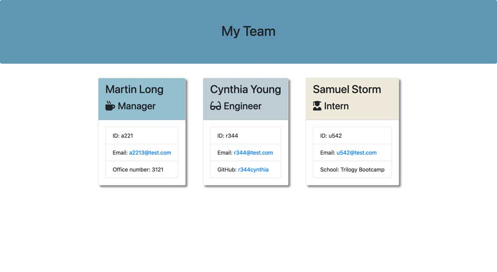

# Team Profile Generator

## Description

This application will take in information about employees on a software engineering team, then generates an HTML webpage that displays summaries for each person.

## Screen Recorder Link

[Team Profile Generator Link](https://watch.screencastify.com/v/Of34SPl8Fz4dE8REZEFl)

## Output File

[Output File](https://github.com/shirleyama/team-profile-generator/blob/main/output/team.html)

## Screenshot

## Table of Contents

1. [Installation](#installation)
2. [Usage](#usage)
3. [Contributing](#contributing)
4. [Tests](#tests)
5. [Questions](#questions)

## Installation

Load it in a node environment and run with node index.js

## Usage

node index.js

## License

Licensed under the MIT license.

## Contributing

shirleyama

## Tests

Locally on my machine on the command line and using JEST too

## Questions

If you have any questions, please feel free to reach out to me via:

- [shirleyama](https://github.com/shirleyama)
- [quists@hotmail.com](mailto:quists@hotmail.com)
